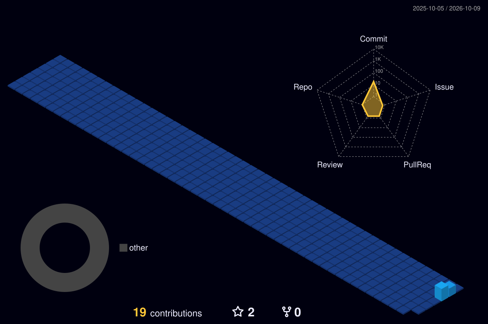

## Hi there,I'm AJITHKUMAR 👋

<!-- ============ HEADER ============ -->

  

  

  
  
  

  <b>Software Developer | Full Stack &amp; AI Engineer | NETWORKING </b> 
  Python • Java • Spring Boot • React • AI/ML • GenAI • LLMs • RAG  
  <i>Building intelligent, scalable applications 🚀</i>

  

---

<!-- ============ ABOUT ============ -->
<h2 align="center">👨‍💻 About Me</h2>

  Hey! I'm <b>Ajithkumar K</b>, a <b>Computer Science &amp; Engineering graduate</b> from India. 
  I'm a <b>Software Developer</b> building full-stack applications with Python, Java, Spring Boot and React, 
  and intelligent systems with AI/ML, GenAI, LLMs and RAG, aimed at practical, real-world problems.

  
  
  
  

<table width="100%" border="0" align="center">
  <tr>
    <td width="50%" align="center" style="padding: 14px;">
      <h4>🎓 Education</h4>
      
<b>B.E. Computer Science &amp; Engineering</b> IFET College of Engineering, Villupuram · Anna University · 2022–2026 
      CGPA: 8.71 

    </td>
    <td width="50%" align="center" style="padding: 14px;">
      <h4>🎯 Career Goal</h4>
      
<b>Software Developer / Full Stack &amp; AI Engineer , Networking </b> Open to roles in Bengaluru &amp; Chennai

    </td>
  </tr>
  <tr>
    <td width="50%" align="center" style="padding: 14px;">
      <h4>🌱 Currently Exploring</h4>
      
<b>GenAI, LLMs &amp; RAG</b> Plus system design and scalable backends

    </td>
    <td width="50%" align="center" style="padding: 14px;">
      <h4>🤝 Collaboration</h4>
      
<b>AI,JAVA, Python &amp; Web projects</b> Open to internships and exciting new work

    </td>
  </tr>
</table>

---

<!-- ============ TECH STACK ============ -->
<h2 align="center">🛠️ Tech Stack &amp; Skills</h2>

<b>Languages</b>

  

<b>Full Stack (Frontend &amp; Backend)</b>

  

<b>Databases</b>

  

<b>AI / ML &amp; Data</b>

  

  
  
  
  
  
  
  

<b>Tools</b>

  

<b>Core CS:</b> OOP · Data Structures · Operating Systems · System Design · Problem Solving

---

<!-- ============ PROJECTS ============ -->
<h2 align="center">🚀 Featured Projects</h2>

<table width="100%" border="0" align="center">
  <tr>
    <td width="50%" valign="top" style="padding: 16px;">
      <h3>🌾 Digital Agri-Waste Marketplace</h3>
      
<i>Full-stack platform connecting farmers and industries for agricultural waste trade, with an AI-based matching engine, GIS mapping and a multilingual chatbot.</i>

      
  

      

    </td>
    <td width="50%" valign="top" style="padding: 16px;">
      <h3>📹 Smart CCTV Surveillance (ML)</h3>
      
<i>AI-based CCTV system that detects unusual activity, identifies faces, tracks movement, and alerts when items go missing.</i>

      
   

      

    </td>
  </tr>
  <tr>
    <td width="50%" valign="top" style="padding: 16px;">
      <h3>🫁 HRSC-Net</h3>
      
<i>Respiratory sound classification using deep learning.</i>

      

    </td>
    <td width="50%" valign="top" style="padding: 16px;">
      <h3>🌦️ Weather Intelligence Platform</h3>
      
<i>Weather platform built with Java, Spring Boot and Angular.</i>

      

    </td>
  </tr>
</table>

Also built: AI-Powered Teaching Assistant (React.js, NLP) · AI-Powered Resume Screening Tool (Python Flask, NLP) · AI-Powered Disease Diagnosis Web App

---

<!-- ============ EXPERIENCE & ACHIEVEMENTS ============ -->
<h2 align="center">💼 Experience &amp; Achievements</h2>

<table width="100%" border="0" align="center">
  <tr>
    <td width="50%" valign="top" style="padding: 14px;">
      <h4>Experience</h4>
      <ul>
        <li><b>Full Stack Development Intern</b> — Nanalogical Consultancy Services (Dec 2024 – Jan 2025)</li>
        <li><b>Technical Mentor</b> — IFET Coding Club</li>
      </ul>
    </td>
    <td width="50%" valign="top" style="padding: 14px;">
      <h4>Achievements</h4>
      <ul>
        <li>CSE Department <b>Second Rank Holder</b> (2025–26)</li>
        <li><b>Top 20 Finalist</b>, Smart India Hackathon (150+ teams)</li>
        <li>Finalist, ISTE National Level Mathematical Competition</li>
      </ul>
    </td>
  </tr>
</table>

<b>Certifications:</b> Python (GUVI) · Python Full Stack, MySQL, AI Engineer, Machine Learning (Udemy) · Intro to GenAI (Google Cloud)

---

<!-- ============ GITHUB ANALYTICS ============ -->
<h2 align="center">📊 GitHub Analytics</h2>

  
  

  

---

<!-- ============ 3D CONTRIBUTION VIEW ============ -->
<h2 align="center">🧊 3D Contribution View</h2>

  

<h2 align="center">🐍 Contribution Journey</h2>

  

---

<!-- ============ CONTACT ============ -->
<h2 align="center">📬 Let's Connect</h2>

<i>Interested in full-stack or AI work? My inbox is always open!</i>

<table border="0" align="center">
  <tr>
    <td align="center" width="220" style="padding: 16px;">
      <a href="https://linkedin.com/in/ajith2812" target="_blank">
          
        
      </a> <b>Professional Network</b>
    </td>
    <td align="center" width="220" style="padding: 16px;">
      <a href="mailto:ajithkumarcse2004@gmail.com">
          
        
      </a> <b>Direct Contact</b>
    </td>
  </tr>
</table>

  

